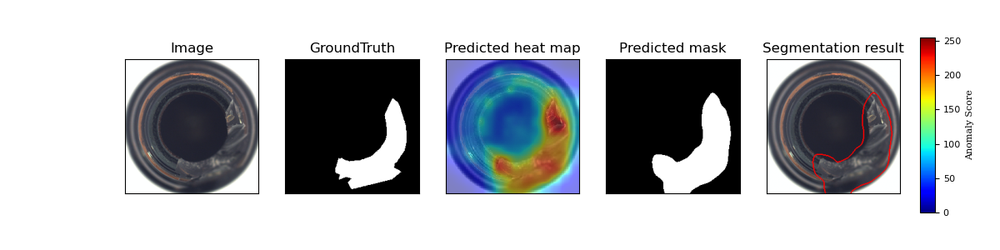

# PaDiM on SageMaker
本workshop演示使用PaDiM在SageMaker上如何进行训练和推理。  
PaDiM可进行异常检测

## 数据准备
[0-preparation](0-preparation)说明按格式准备好数据，并放入到S3。
## 训练
[1-training](1-training)演示在SageMaker上进行训练。
## 推理
[2-inference](2-inference)演示在SageMaker上部署Endpoint，以及调用Endpoint进行推理。