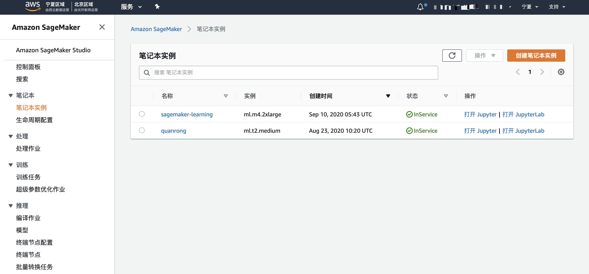

# 利用Amazon SageMaker内置算法进行图片分类
Image-classification-lst-format.ipynb演示了利用Amazon SageMaker内置算法进行图片分类模型的训练和部署。

## 启动Amazon SageMaker笔记本实例
通过以下步骤启动Amazon SageMaker的笔记本实例
* 访问SageMaker主页，点击左边栏目笔记本实例链接

## 升级相应Kernel中sagemaker版本
* conda env list
* source  activate mxnet_p36 
* pip install sagemaker --upgrade  
执行完以上命令重启kenrnel