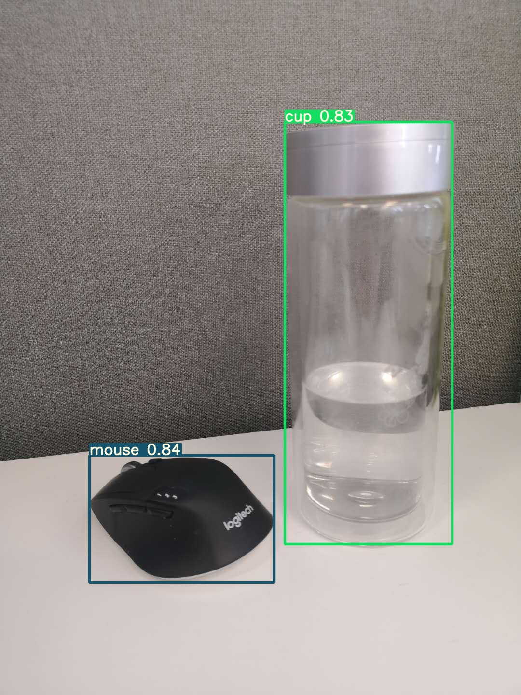

# YOLOv5 on SageMaker
本workshop演示使用YOLOv5在SageMaker上如何进行训练和推理。  
YOLOv5官方地址：https://github.com/ultralytics/yolov5  
YOLOv5是一个对象检测算法，可识别图片、视频里的对象。

## 数据准备
[0-preparation](0-preparation)演示把labelme数据格式转化为YOLOv5格式，如果已有YOLOv5格式的数据，可跳过数据准备，把数据按要求放入到S3即可。
## 训练
[1-training](1-training)演示在SageMaker上进行训练。
## 推理
[2-inference](2-inference)演示在SageMaker上部署Endpoint，以及调用Endpoint进行推理。